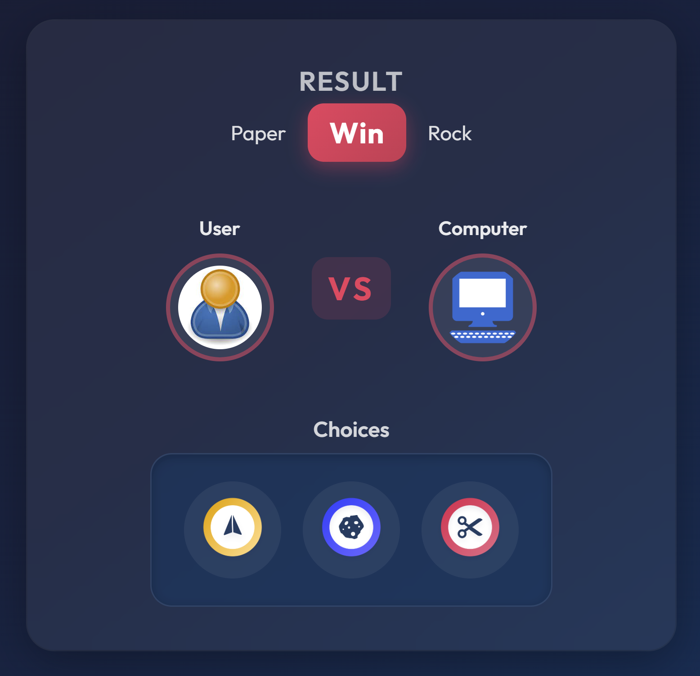

# Rock Paper Scissors Game

**This assignment is about practicing React state.** You will complete a Rock Paper Scissors game by filling in the missing pieces: using `useState` in the parent, passing state and handlers via **props** to child components, and handling user input. The game logic (random computer pick, win/loss calculation) is already implemented in `src/utils/index.js`—your job is to connect the UI to that logic using React state and props.

You must have played "Rock Paper Scissors" at least once. Here you will build it on the web: the user picks Rock, Paper, or Scissors; the computer picks at random; the app shows the result (Win / Lost / Peace).

|  |
| :-------------------------------------------------------------------: |
|                      _Rock Paper Scissors Game_                       |

[Go to demo website !](https://m2-rock-paper-scissor.vercel.app)

---

## Where should I work?

- **Branch:** Work on the **`master`** branch. That’s where the "Your code here" placeholders are. Use the **`solution`** branch only as a reference; don’t edit it.
- **Locations:** Search the repo for **`"Your code here"`** to find every spot you must complete. You should **only** change those designated areas; leave the rest of the codebase as is.

| File | What you need to do |
|------|---------------------|
| **`src/components/Result.js`** | Destructure the props: `user1GameItem`, `user2GameItem`, `result`. |
| **`src/components/Player.js`** | Use the `avatarUrl` and `name` props for the `` `src` and `alt`. |
| **`src/components/Main.js`** | Pass the real state and handler into `<Result>` and `<Choices>` instead of the placeholder strings (e.g. `user1GameItem`, `user2GameItem`, `result`, `gameItems`, `handleGameItemChange`). |
| **`src/components/Choices.js`** | Pass the `handleGameItemChange` prop through to each `<ChoiceCard>`. |
| **`src/components/ChoiceCard.js`** | Call `handleGameItemChange` when the choice is clicked (e.g. in `onClick`). |

All of these are in the **`src/components/`** folder (and the state lives in **`src/components/Main.js`**). The **`src/utils/index.js`** and **`src/App.js`** are provided; you don’t need to change them for the assignment.

---

## User Story

- User plays "Rock Paper Scissors" against the computer.
- User selects "Rock", "Paper", or "Scissors"; the game runs.
- User selection triggers the computer’s (random) selection.
- The result is shown immediately (Win / Lost / Peace).

## Branches and setup

**Repository:**

- **`master`** — This is where you code. All "Your code here" placeholders are on this branch.  
  [View on GitHub →](https://github.com/nauqh/m2-rock-paper-scissor/tree/master)
- **`solution`** — Reference solution. Use it only to check answers; don’t edit it.

**Get started:**

1. **Fork** the repo on GitHub: [nauqh/m2-rock-paper-scissor](https://github.com/nauqh/m2-rock-paper-scissor) → click **Fork**.
2. **Clone** your fork (replace `YOUR_USERNAME` with your GitHub username):  
   `git clone https://github.com/YOUR_USERNAME/m2-rock-paper-scissor.git`
3. **Checkout** the `master` branch (this is your working branch):  
   `git checkout master`
4. Search the codebase for **"Your code here"** to see every spot you need to complete.

**To view the solution later:**  
`git checkout solution`

## Explain code

- src/utils/index.js

```
# input: gamesItems is a list of items.
# return: a random item in the list.
# Description: get random item from gamesItems list.
```

```javascript
export const getRandomGameItem = (gamesItems) => {
  const index = Math.floor(Math.random() * gamesItems.length); //create index random between 0 to gamesItems.length - 1
  return gamesItems[index]; //return item
};
```

```
# input: user1GameItem, user2GameItem - is object game, contains game item id and list can win.
Object example:
user1GameItem = {
    url: "/images/paper.png",
    id: 0,
    winItemIds: [1],
    name: "Paper",
}
# return: game result.
# Description: calculator result player.
```

```javascript
export const calculatorUserWinner = (user1GameItem, user2GameItem) => {
  if (user1GameItem.id === user2GameItem.id) {
    return "Peace"; //return both player same.
  } else if (user1GameItem.winItemIds.includes(user2GameItem.id)) {
    return "Win"; //if player 1 winItemIds list contain game player 2 id => player 1 win player 2.
  } else {
    return "Lost"; //if winItemIds list not contain game player 2 id => player 1 lost, player 2 .
  }
};
```
